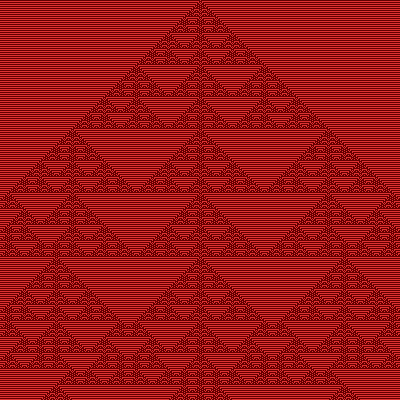

# CATWeaver
## Cellular Automata Tiling Weaver
### Generate images with patterns from popular cellular automata
### Written by Charles Cook and Sean Curry

#### ToDo:
* Implement main automata
	* One Dimensional Automata
		* Rule 30
		* Rule 110
	* Two Dimensional Automata
		* Toothpick Sequence
		* Langton's Ant
		* Seeds
* Implement image engine
* Implement ruleset creation dialog(s)
* Implement ruleset JSON I/O

### Organization

Going forward, I think it's best if we figure out who is specifically doing what. Below is a list of the things that are going to (preferably) be in the program - whoever wants to take care of any of these features, put your name beside it: 

* Automaton implementation (Sean) \[I think I commandeered this one by accident... o_o]
	* 1D Automata
		* Rule 30 (done)
		* Rule 110 (done)
	* 2D Automata
		* Toothpick sequence
		* Langton's ant
		* Seeds (done)
	* Optional (these don't have rule strings and may or may not actually be implemented)
		* Rock-paper-scissors automaton
		* Nonlinear voter model
		* Hodgepodge machine (done)
* Image preview engine
* Image saving engine (Sean)
* Ruleset creation dialog (Charlie)
* Initial state dialog
* JSON I/O (Charlie)
* Automaton/JSON compatibility
